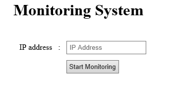
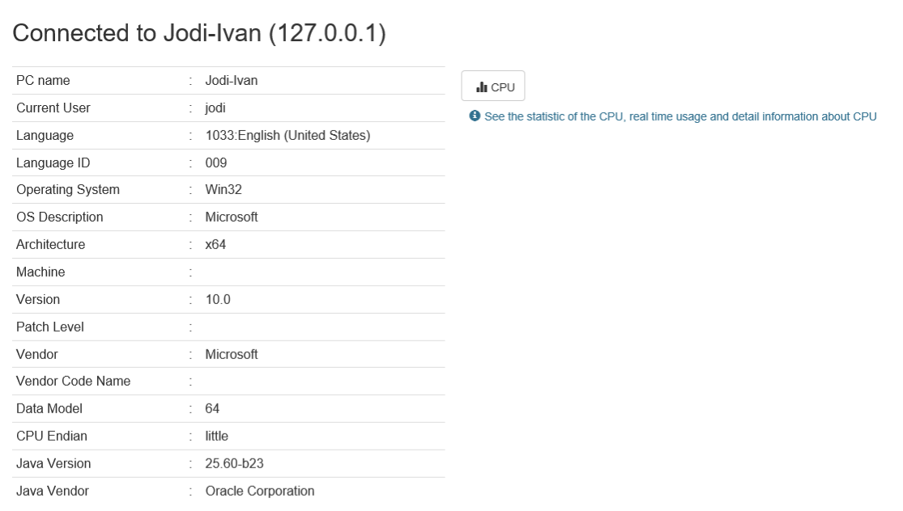
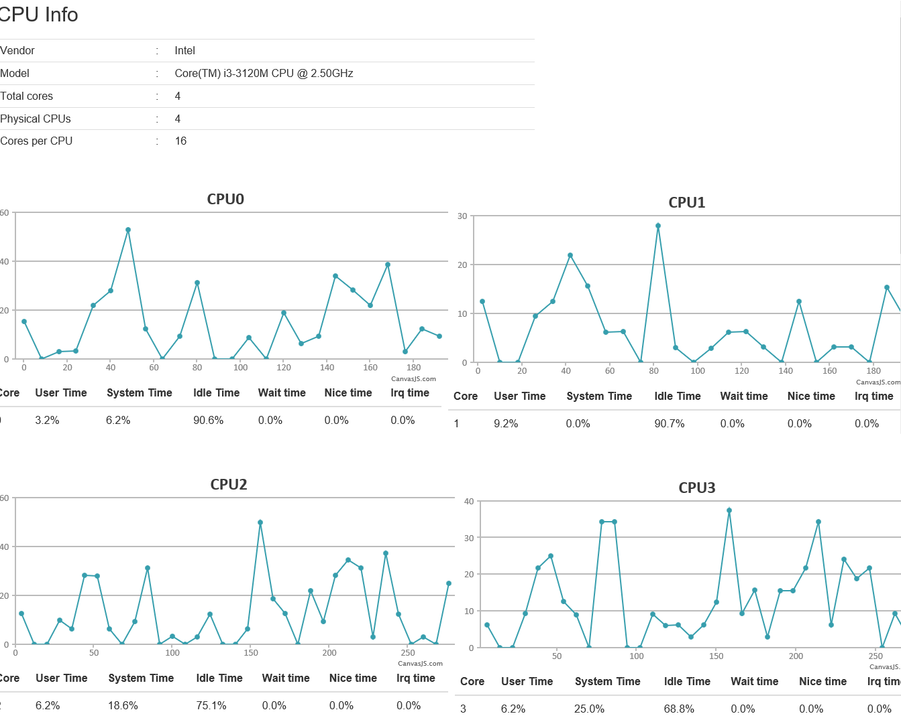
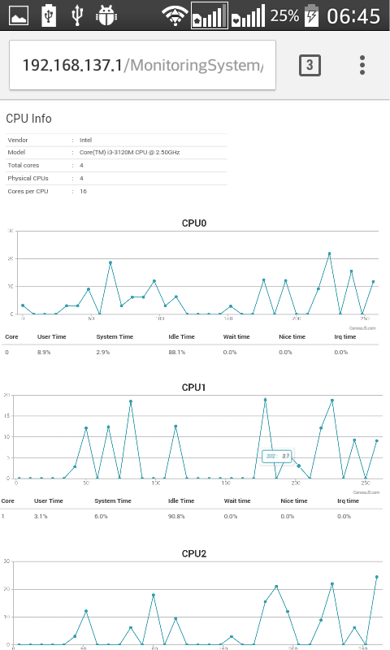
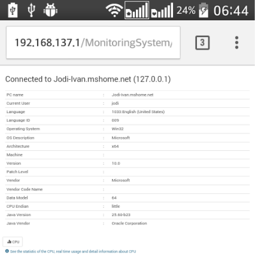

# **CPU Monitoring System — Java Socket Programming + PHP + JS Frontend**

A multi-component system for monitoring CPU activity over TCP/UDP sockets, built as a college networking project.
Includes:

* A Java **TCP server**
* A Java **CPU info sender** (UDP)
* A PHP **bridge layer** executing JARs
* A JavaScript **web interface** for visualization

This project demonstrates socket programming, multi-process communication, and basic system information retrieval.

---

## 📌 **Note on Project Origin**

This project was developed as part of a university networking assignment.
The architecture reflects the requirements and constraints of the course (Java for sockets, PHP for web integration).
The focus is on **network protocols, process coordination, and CPU usage retrieval**, not on modern frameworks.

---

# 🎯 **System Overview**

### Components:

1. **Java TCP Server**
   Handles commands from clients and returns system information.

2. **Java CPU Data Sender (UDP)**
   Sends continuous CPU usage packets over UDP to a specified IP.
   Triggered by TCP command `"PRINTCORE"`.

3. **PHP Backend**
   Executes Java JAR files and forwards results to the JS frontend.

4. **JavaScript Frontend**
   Displays CPU usage and system information in a web-based UI.

---

# 🧱 **Features**

### ✔ CPU Monitoring

* Print CPU info
* Monitor cores
* Request system information
* Stream CPU core metrics via UDP

### ✔ Supported TCP Commands

| Command      | Description                  |
| ------------ | ---------------------------- |
| `CHK`        | Health-check → returns `ACK` |
| `SYSINFO`    | Returns system info          |
| `CPUINFO`    | Returns CPU specs            |
| `PRINTCORES` | Returns logical core list    |
| `PRINTCORE`  | Starts UDP sender thread     |
| `STOP`       | Stops the data sender        |

### ✔ Multi-Protocol Architecture

* TCP for control messages
* UDP for high-frequency CPU usage streaming
* PHP bridging execution
* JS frontend visualizing metrics

---

# 📡 **Architecture Diagram**

*(You can add a PNG later)*

```
   +------------+        http        +-----------------+
   |  Web (JS)  | <--------------->  |  PHP Backend     |
   +------------+                    +-------+----------+
                                            |
                                            | exec()
                                            v
                                      +-----------+
                                      | Java JAR  |
                                      | (Client)  |
                                      +-----+-----+
                                            |
                            TCP/UDP         |
                                            v
                                      +-----------+
                                      | Java TCP  |
                                      |  Server   |
                                      +-----------+
```

---

# 🚀 **Running the System (Using Release Files)**

This project includes precompiled binaries in the **Releases** tab, so users do not need to compile Java or install dependencies manually.

Below is the correct way to run each component of the monitoring system.

---

# 🖥 **1. Running the CPU Monitoring Client (Java + Sigar)**

This is the application that runs on the **machine being monitored**.
It collects CPU information and communicates with the server.

### **Steps (Windows):**

1. Download the release ZIP.
2. Extract it.
3. Inside the extracted folder, locate:

```
MonitoringSystem.bat
MonitoringSystem.jar
MonitoringSystem_lib/
```

4. **Double–click `MonitoringSystem.bat`**
   OR run:

```
MonitoringSystem.bat
```

5. The client will connect to the monitoring server and start reporting CPU metrics.

### **What these files do**

* `MonitoringSystem.jar` — Java application that retrieves system info
* `MonitoringSystem_lib/` — contains **Sigar** dependencies for CPU/OS stats
* `MonitoringSystem.bat` — convenience launcher that sets up classpath automatically

---

# 🌐 **2. Running the Web Client (Frontend + PHP/JS Bridge)**

Place the executables inside the **`web-client/executables/`** directory:

```
web-client/
  ├── index.php
  ├── home.php
  ├── functions.php
  ├── CPU/
  ├── Assets/
  └── executables/
        ├── PacketReceiver.jar
        └── TCPClient.jar
```

### Files:

```
PacketReceiver.jar   # receives UDP CPU packets
TCPClient.jar        # sends TCP commands to target machine
```

### Then:

* Load the php and open index.php
* The JS frontend will call the PHP backend
* PHP will execute the JAR files to request data from the server

---


# 🧭 **Summary of Execution Flow**

1. **Start the Monitoring System** on the machine to be monitored
2. **Place PacketReceiver.jar and TCPClient.jar** into `web-client/executables/`
3. **Set up the PHP Server** and open index.php 

    

4. Put the IP address and Press `Start Monitoring`. The system will display the system information
5. Click the `📊 CPU` Icon to see all the cores CPU usage in real time 

---

# 📂 **Repository Structure**

```
cpu-monitoring-system/
│
├── server-java/
│    └── source of TCP server
├── client-java/
│    └── UDP CPU sender
├── web-client/
│    └── PHP bridge layer and Web interface
├── docs/
└── README.md
```

# 🖼 Screenshots

## Desktop





## Mobile




---

# 🧭 **Reflection**

* Replace PHP exec() with a proper API
* Merge TCP + UDP into a unified protocol
